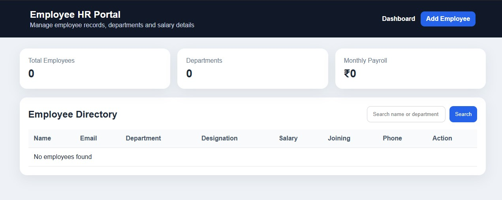

# Employee HR Portal

A Java full-stack employee management project built with Spring Boot, React, MySQL and REST APIs. The system helps manage employee records with CRUD operations, searching, department details and salary tracking.

# 📸 Project Screenshots

## ➕ Add Employee


## 📊 Dashboard


## 📋 Employee List


## Features

- Add, view, update and delete employee records
- Search employees by first name, last name or department
- Dashboard cards for total employees, departments and monthly payroll
- MySQL database integration
- React responsive UI
- REST API backend with Spring Boot and Spring Data JPA

## Tech Stack

- Java 17+
- Spring Boot
- Spring Data JPA
- MySQL
- React
- Vite
- Axios
- React Router DOM

## Project Structure

```text
Employee-HR-Portal
├── hr-portal-backend
├── hr-portal-frontend
├── database.sql
└── README.md
```

## Database Setup

Open MySQL and run:

```sql
SOURCE database.sql;
```

Or manually run the SQL file from MySQL Workbench.

Then update this file:

```text
hr-portal-backend/src/main/resources/application.properties
```

Change:

```properties
spring.datasource.password=your_mysql_password
```

## Run Backend

```bash
cd hr-portal-backend
mvn spring-boot:run
```

Backend will run on:

```text
http://localhost:8080
```

## Run Frontend

```bash
cd hr-portal-frontend
npm install
npm run dev
```

Frontend will run on:

```text
http://localhost:5173
```

## REST APIs

| Method | URL | Description |
|---|---|---|
| GET | `/api/employees` | Get all employees |
| GET | `/api/employees/{id}` | Get employee by ID |
| POST | `/api/employees` | Create employee |
| PUT | `/api/employees/{id}` | Update employee |
| DELETE | `/api/employees/{id}` | Delete employee |
| GET | `/api/employees/search?keyword=it` | Search employees |

## Resume Description

Developed a full-stack Employee HR Portal using React, Spring Boot, MySQL and REST APIs with CRUD operations, search functionality, dashboard analytics and responsive UI.

## Note

This project was customized and extended for learning and portfolio use. Add your own screenshots after running the application.
