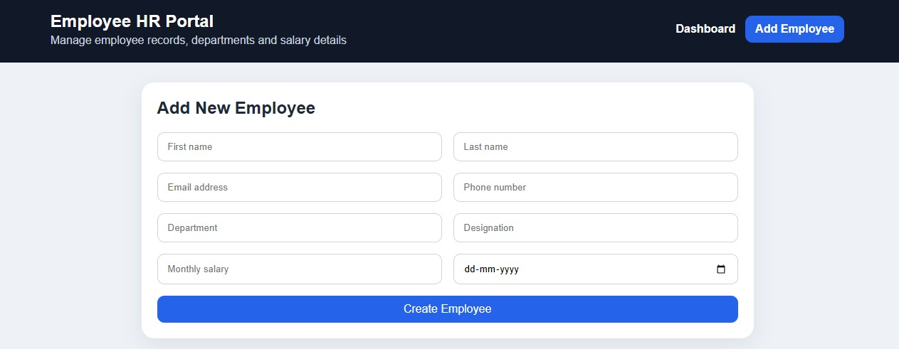
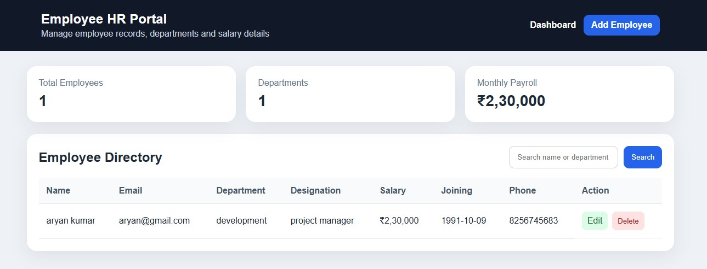

# 🚀 Employee HR Portal

Modern Employee HR Portal designed for efficient employee management with dashboard analytics, employee records, add/list operations, secure backend integration, responsive UI, and seamless frontend-backend connectivity using Spring Boot, React, MySQL, and modern web technologies.

---

# ✨ Features

- Employee Management
- Add Employee
- Employee List
- Dashboard Analytics
- Responsive User Interface
- REST API Integration
- Backend Database Connectivity
- Full CRUD Operations

---

# 🛠️ Tech Stack

## Frontend
- React.js
- JavaScript
- CSS

## Backend
- Spring Boot
- Java
- REST API

## Database
- MySQL

---


# 📸 Project Screenshots

## ➕ Add Employee


## 📊 Dashboard


## 📋 Employee List

# ▶️ Run Backend

```bash
cd hr-portal-backend
mvn spring-boot:run
```

Backend runs on:

```txt
http://localhost:8080
```

---

# ▶️ Run Frontend

```bash
cd hr-portal-frontend
npm install
npm run dev
```

Frontend usually runs on:

```txt
http://localhost:5173
```

---

# 🗄️ Database Setup

Open MySQL and create database:

```sql
CREATE DATABASE hr_portal_db;
```

Update database credentials in:

```txt
src/main/resources/application.properties
```

---

# 🌟 Project Goal

This project demonstrates full-stack development skills including frontend-backend integration, REST API development, employee management workflows, responsive UI design, database connectivity, and modern enterprise application structure.
